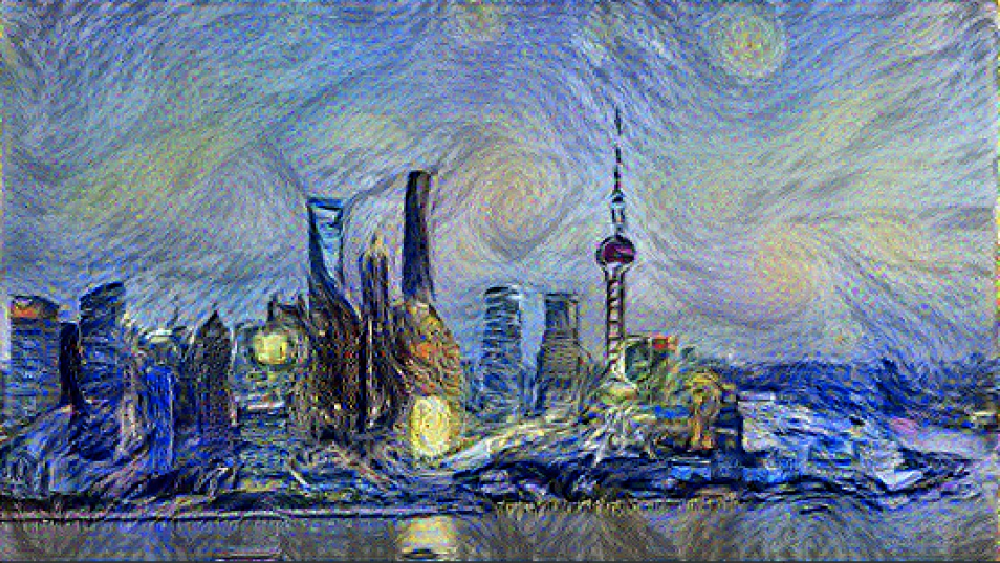

# GR5242-final-project
The final project for GR5242 Advanced Machine Learning.  
Group member: Sitong Liu, Zixiao Wang, Xingyu Chen, Yue Zhang

Project Name: Neural style transfer

The purpose of this project is to implement a neural style transfer algorithm, which is able to extract the style of the style image and applying it to a content image using Convolutional Neural Networks. We use a pretrained VGG19 to generate content and style representations. The algorithm will produce the image after keeping minimizing the total loss function. We focus on the impact of different parameters on the generated image.

The following image is an example of the output pictures generated by our algorithm.

Resources: https://www.cv-foundation.org/openaccess/content_cvpr_2016/papers/Gatys_Image_Style_Transfer_CVPR_2016_paper.pdf
